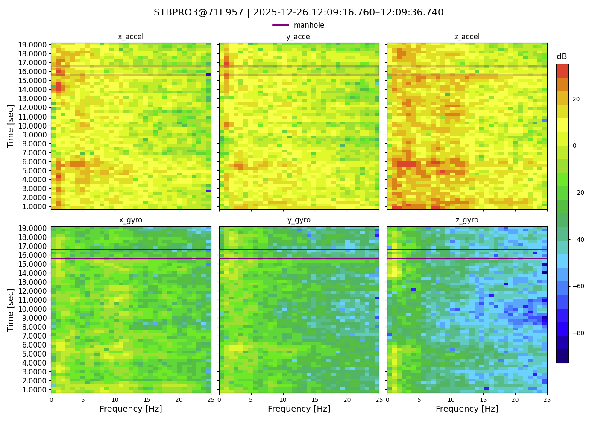

# Plotter CLI

The plotter CLI lives in `potholes.tools.plot`. Run commands from the repository root.

```powershell
python -m potholes.tools.plot --help
```

## Commands

### Plot a generated sample

Creates a 6-panel spectrogram plot from a sample file generated by the loader.
The sample folder must also contain `spectrogram_params.yaml`.

Usage:
```shell-session
$ uv run -m potholes.tools.plot plot-sample --help

Usage: python -m potholes.tools.plot plot-sample [OPTIONS] SAMPLE_FILE

Options:
  -o, --output PATH  Write the plot to this file (e.g. out.png). If omitted, show interactively.
  --help  Show this message and exit.
```

Example:
```shell-session
$ uv run -m potholes.tools.plot plot-sample output/session_*/data_0_20_1_normal.npz -o out/sample.png

(no stdout; writes out/sample.png)
```


### Plot a window from a session CSV

Plots a time window from a `session_*.csv` file produced by the loader.

Usage:
```shell-session
$ uv run -m potholes.tools.plot plot-session-sample --help

Usage: python -m potholes.tools.plot plot-session-sample [OPTIONS] SESSION_FILE START_SECOND

Options:
  -w, --window-size INTEGER  Window size
  -o, --output PATH  Write the plot to this file (e.g. out.png). If omitted, show interactively.
  --help  Show this message and exit.
```

Example:
```shell-session
$ uv run -m potholes.tools.plot plot-session-sample output/session_*/session_*.csv 10 -w 20 -o out/window.png

(no stdout; writes out/window.png)
```

