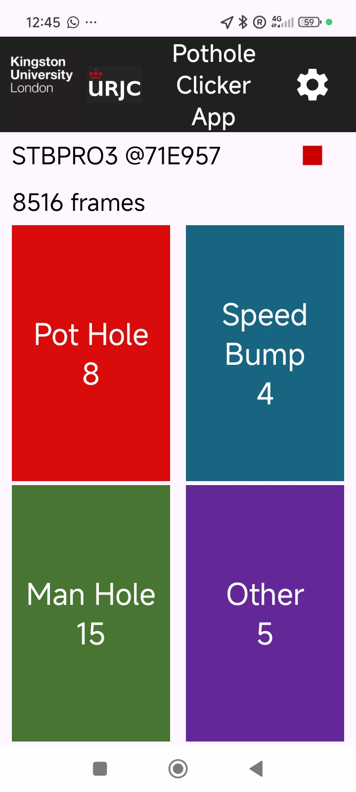

# Data Collection and Preprocessing



## The data collection application

The data collection application collects information from the connected sensor, the mobile phone GPS and the user 
input through the labeling buttons provided. 

Every time the start button is pressed, a new session is generated. A 
key containing date and starting time of the session is appended to each file name.

### Generated files per session
- `metadata__{session_key}.yaml`
- `accel_{session_key}.csv`
- `gyro_{session_key}.csv`
- `labels_{session_key}.csv`

Example:

```text
data/
  Data_20260108/
    metadata__20260108_161834.yaml
    accel_20260108_161834.csv
    gyro_20260108_161834.csv
    labels_20260108_161834.csv
```
## The processing pipeline

The preprocessing pipeline generates the data files needed for further processing in machine learning systems. To do
it it does the following steps:

1. Discovers sensor sessions from `metadata*.yaml`.
2. Loads accelerometer, gyroscope, GPS, and labels.
3. Resamples to a uniform rate and merges labels.
4. Writes a session CSV and an HTML route map.
5. Optionally generates spectrogram samples for training.